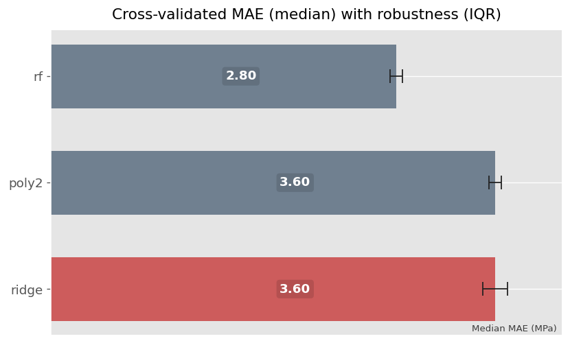

# Study Case 2 — AA3105-O: Chemistry-Only UTS Model

## Position in the Portfolio

This study case builds directly on Study Case 1 ([SQL reproducibility foundation](https://github.com/ivvza-io/sql-analytics-case-study)) and establishes the first modeling baseline, relying entirely on the reproducible semantic layer defined there.

It tests whether **chemistry alone** contains enough predictive signal to support **robust engineering design decisions**, before introducing any process or geometry variables.
---
**TL;DR**
- Chemistry alone explains a large and stable portion of UTS variability at the heat level.
- Group-aware, out-of-fold evaluation enables realistic risk estimation.
- The resulting models support early-stage, risk-aware design decisions—but not final release.

---

## Core Question

**Using chemistry only, can we produce risk-aware, decision-relevant predictions for UTS that are useful for robust design under real specification constraints?**

---

## Thesis

> From a metallurgical perspective, chemistry features contain a strong and stable predictive signal for UTS, sufficient to support risk-aware engineering decisions.
> When paired with empirically observed uncertainty derived from out-of-fold error, this signal can be translated into conservative composition margins that reduce non-conformance risk.

---

## Scope and Constraints

### In scope
- Chemistry-only feature set
- UTS prediction as the primary target
- Heat-level aggregation and validation
- Group-aware evaluation to avoid leakage across related heats/conditions
- Empirical uncertainty estimation based on out-of-fold error
- Interpretability sufficient to support engineering insight

### Out of scope (explicit)
- Adding process or route variables (reserved for later study cases)
- Domain-specific microstructure proxies beyond chemistry
- Extensive hyperparameter tuning aimed at leaderboard performance
- Multitarget models (e.g., UTS + YS + elongation) unless required by data availability

> Although the underlying modeling framework can be extended to other mechanical properties
(e.g., yield strength and elongation), this study case focuses on UTS as a representative target as a solid base for future improvements. This allows a controlled evaluation of chemistry-only predictive signal without introducing additional domain-specific complexity.

---

## Data Inputs 

All data, join keys, and grain guarantees are provided by the SC1 semantic views.

- Chemistry composition records for heats
- Mechanical test results providing UTS target values

**Assumptions:**
- One row per heat/test definition
- Valid chemistry ranges within specification

---

## Method Overview

1. **Baseline modeling**
   - Simple baseline (e.g., linear / ridge) as a reference
   - Polynomial model for baseline comparison
   - One ML baseline (e.g., tree-based) for non-linear signal capture
   - Keep modeling choices conservative and interpretable
   - Random Forest is used as a non-linear probe, not as a production candidate.

2. **Validation strategy**
   - Group-aware cross-validation (e.g., GroupKFold) aligned with industrial reality
   - Report performance distributions across folds, not just averages

3. **Uncertainty and robustness**
   - Use out-of-fold residuals to estimate realistic prediction error
   - Translate empirical error into conservative safety margins for design reasoning

4. **Interpretability**
   - Identify dominant chemistry drivers (global + local where helpful)
   - Translate into engineering-relevant insights (not feature importance theater)

---

## Model comparison and robustness assessment

To evaluate whether chemistry-only models can support **risk-aware engineering decisions**, models are compared using **out-of-fold performance under group-aware cross-validation**.

The figure below summarizes the **median cross-validated MAE**, together with its **interquartile range (IQR)** across folds:

**Interpretation:**

- **Random Forest (RF)** achieves the lowest median MAE, indicating strong predictive capability.
- **Ridge and polynomial models** exhibit slightly higher median error, but comparable robustness.
- Despite its lower MAE, **RF is not retained as the primary design model**, as its non-smooth response surfaces and limited interpretability reduce suitability for downstream engineering tools.

This comparison illustrates a key principle of this portfolio:

> **The preferred model is not the one with the lowest error, but the one that best balances accuracy, robustness, and interpretability under realistic validation.**

As a result, **ridge regression** is selected as the reference chemistry-only model for subsequent study cases, providing a stable and interpretable foundation for uncertainty quantification and design map construction.

---

## Expected Outputs

### Tables
- Baseline vs ML comparison (MAE, RMSE, R²) under GroupKFold
- Out-of-fold error statistics used as conservative margins

### Figures
- Predicted vs actual (out-of-fold)
- Residual diagnostics (out-of-fold)

---

## Evaluation Criteria

A model is considered useful if it demonstrates:

- **Consistent predictive signal** across group folds (not just overall fit)
- **Stable and unbiased out-of-fold error**, suitable for conservative decision-making
- **Actionable interpretability**: stable chemistry drivers, plausible metallurgy
- **Decision value**: potential to define conservative regions and margins under constraints

Not considered success criteria:
- maximizing R² via aggressive tuning
- highly complex models without interpretability
- single-number reporting without uncertainty

---

## Exit Condition

This study case is complete when:

- A chemistry-only baseline and a simple ML model are implemented and evaluated
- Group-aware results are reproducible from the semantic layer
- Out-of-fold error is quantified and used as an empirical safety margin
- Models show potential to be used as a consistent set of conservative design maps
- Findings can be summarized into decision-oriented guidance

---

## Anti-Scope (What This Study Case Does Not Do)

- No process-aware modeling
- No large feature expansion
- No multi-variable design tools beyond chemistry space
- No “production deployment” work (focus is analytical demonstration)

These are intentionally deferred to later study cases.

---
## Key takeaway
> This study demonstrates that chemistry alone defines a large portion of the feasible strength envelope. While insufficient for final quality release, it provides a robust, early-stage decision tool to reduce risk and focus downstream process optimization.

---

## Relationship to Next Study Case

Study Case 2 establishes the chemistry-only baseline.

Study Case 3 will reuse the same methodology across additional alloy/temper systems to test generalization and identify where chemistry is sufficient vs where process dominates.

