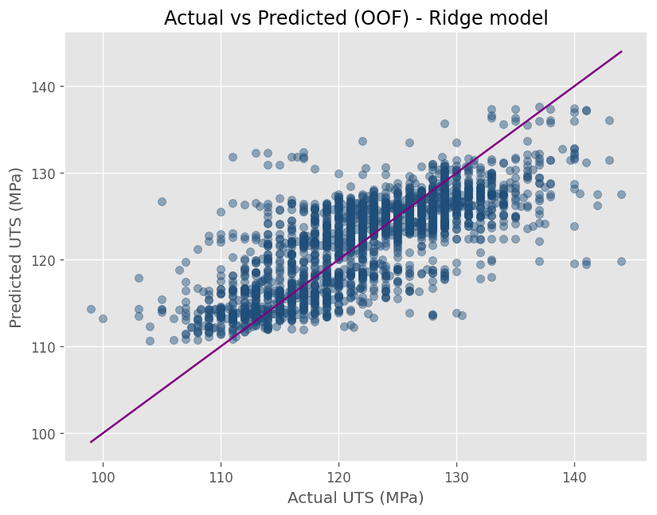
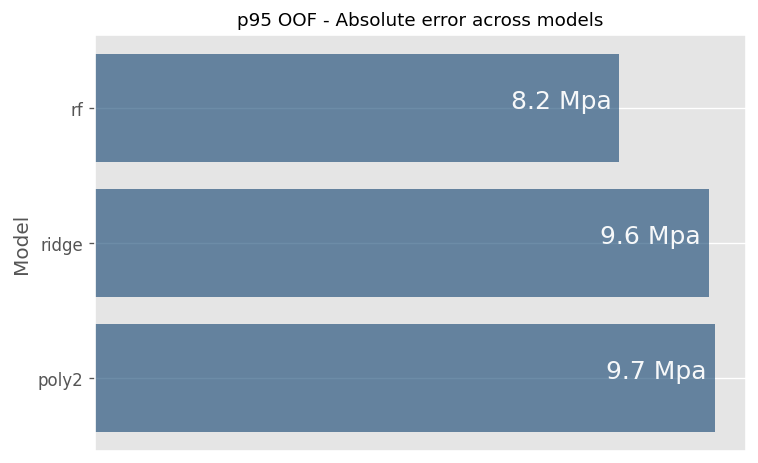

# SC02 — Chemistry-Only Modeling of UTS (AA3105-O)

> **Chemical composition contains sufficient signal to support data-driven internal standard definition for UTS, enabling conservative early-stage risk management without relying on extensive physical trial campaigns.**

---

## 1. Why This Study Case Exists

In the industrial context that motivated this work, the organization lacked **internal standards** across multiple dimensions:
- Chemical composition
- Mechanical properties
- Process targets

As long as materials complied with **bussines common specifications**, they were released, even when recurring downstream issues were observed:

- Materials consistently too hard or too soft
- Unstable forming behavior
- Customer claims despite formal compliance

The absence of internal standards made it impossible to distinguish between:
- *Chemistries that are acceptable*
- *Chemistries that are operationally robust*

Defining internal standards through **physical trial campaigns** would have required significant time, cost, and production disruption.  
This study case evaluates whether **historical production and testing data** can be used to **initiate internal chemistry-based standards for UTS**, starting from the earliest controllable variable in the process chain.

---

## 2. Problem Framing and Hypothesis

### Strategic Problem

External specifications define **allowable ranges**, not **operational targets**.

Without internal standards:
- Decision-making relies on binary compliance
- Risk accumulates silently within the specification window
- Engineering teams lack quantitative guidance for preventive action

The central strategic question is therefore:

> **Can internal, data-driven chemistry targets for UTS be defined using historical data, without relying on extensive physical testing?**

### Hypothesis

> *Chemical composition alone contains a statistically meaningful and stable signal for UTS, sufficient to support the definition of conservative internal chemistry standards, even if it is insufficient for final property release.*

**Out of scope:**
- Process variables
- Microstructural descriptors
- Release-grade prediction

These exclusions are intentional to evaluate whether chemistry alone is a viable foundation for internal standardization.

---

## 3. Modeling Philosophy and Design Principles

### 3.1 Signal Before Complexity  
Before introducing additional variables or complex learners, it is essential to verify that **any usable signal exists** in chemistry alone.

### 3.2 Interpretability Over Marginal Accuracy  
Internal standards must be explainable, stable, and **communicable** across engineering and quality teams.  
For this reason, models are evaluated not only by MAE, but by:
- Stability across validation folds
- Continuity of response surfaces
- Suitability for defining conservative target regions

### 3.3 Tail Risk Matters More Than Mean Error  
Standards exist to prevent **rare but costly failures**, not to optimize average performance.  
Tail behavior is therefore treated as a first-class concern.

---

## 4. Methodological Decisions (What We Chose — and Why)

- **Analytical unit:** heat-level aggregation (one row per heat)  
- **Validation:** Group-aware cross-validation by heat to prevent leakage
- **Error basis:** exclusively out-of-fold predictions
- **Model classes:** linear and mildly flexible models prioritized

More complex non-linear learners were deliberately excluded to preserve:
- Interpretability
- Surface continuity
- Robustness of derived standards

> Common portfolio-wide assumptions and conventions are documented in  
> → [`README_EXTENDED.md`](https://github.com/ivvza-io/analytics-engineering-portfolio/blob/main/docs/README_EXTENDED.md)
> Design rationale, methodological decisions, and implementation-level technical documentation are maintained in  
→ [`docs/technical-notes`](https://github.com/ivvza-io/sc02-chemistry-only-mechanical-properties/tree/main/docs/technical_notes.md)

---

## 5. Key Results and Evidence

### 5.1 Domain of Applicability (Chemistry & UTS)

**Table 1 — Chemistry and UTS domain (heat-level, study window)**

| Variable | Min | P01 | P50 | P99 | Max |
|--------|-----|-----|-----|-----|-----|
| Mn (%) | 0.295 | 0.313 | 0.441 | 0.602 | 0.699 |
| Mg (%) | 0.200 | 0.202 | 0.432 | 0.713 | 0.776 |
| UTS (MPa) | 99 | 107 | 122 | 140 | 144 |

*Extreme values are intentionally retained, as they reflect real operational variability rather than measurement noise.*

This table defines the **chemical and mechanical envelope** within which internal standards are evaluated.

---

### 5.2 Cross-Validated Performance and Tail Risk

**Table 2 — Out-of-fold performance summary**

| Model | MAE (median, MPa) | P95 absolute error (MPa) |
|-----|------------------|-------------------------|
| Ridge | 3.6 | 9.6 |
| Poly2 | 3.6 | 9.8 |
| Random Forest | 2.9 | 8.2 |

Key observations:
- Chemistry-only models exhibit **stable, non-trivial predictive signal**
- Differences in median MAE are moderate
- **Tail error (P95)** reveals clearer separation between model families

**Important design decision:**   
Although tree-based models achieve lower raw error metrics, they were not selected as the basis for internal standards due to:

- Reduced surface smoothness
- Higher sensitivity to local data density
- Lower suitability for defining stable, communicable design regions

Metric improvements that compromise robustness and interpretability are not considered acceptable for standard definition.

---

### 5.3 Reliability Diagnostics (Visual Evidence)

**Figure 1 — Out-of-fold Actual vs Predicted (Ridge)**  

> *Out-of-fold predictions for unseen heats show centered errors and no strong systematic bias, supporting conservative interpretation for standard definition.*

---

**Figure 2 — P95 Absolute Error by Model**  

> *Tail error differences are more informative than average accuracy when defining conservative internal standards.*

---

### 5.4 Interpretability and Plausibility Check

**Table 3 — Relative importance of chemistry drivers (qualitative)**

| Feature | Relative importance |
|-------|--------------------|
| Mg | High |
| Mn | Moderate |

Feature importance is used here as a **trust check**, not as exhaustive explainability.  
Dominant drivers are stable across folds and metallurgically plausible.

---

## 6. Interpretation: What This Means for Decisions

This study enables a shift from **compliance-driven** to **standard-driven** decision-making.

From:
> *“Is this chemistry within the external specification?”*

To:
> **“Where should internal chemistry targets be set to consistently achieve robust UTS behavior?”**

In practice:
- Internal chemistry targets can be defined **within** the external specification window
- High-risk regions of composition space can be identified early
- Physical trial campaigns can be reduced, delayed, or better targeted

**Risk assessment emerges as a secondary outcome**:
- Once internal targets are defined, deviation from them can be quantified as risk
- This supports conservative early-stage screening prior to production decisions

Chemistry thus transitions from a compliance variable into a **design and standardization lever**.

---

## 7. What This Model Is — and Is Not

### This Model *Is*:
- A foundation for **internal chemistry-based UTS standards**
- A screening tool for early-stage risk assessment
- A mechanism to move beyond binary compliance

### This Model *Is Not*:
- A release-grade predictor
- A replacement for mechanical testing
- A complete representation of process–property interactions

Explicit boundaries prevent misuse.

---

## 8. Limitations, Risks, and Failure Modes

- Chemistry does not capture all drivers of mechanical properties
- Error magnitude may vary across composition regions
- Uncertainty estimates derived here are **global**, not locally adaptive
- Standards derived from historical data may drift as processes evolve

These limitations motivate the uncertainty-aware and multi-variable extensions developed in later study cases.

---

## 9. Why This Study Case Matters in the Portfolio

This study case establishes the **foundation of the portfolio’s standardization narrative**:

1. Internal standards can be **initiated using data**, not trial-and-error
2. Chemistry provides sufficient signal to justify this effort
3. Conservative treatment of uncertainty is mandatory

Subsequent study cases build directly on these conclusions:
- **SC03** tests whether similar standards generalize across alloy systems
- **SC04** evaluates which additional variables justify inclusion in standards
- **SC05** translates standards into uncertainty-aware decision tools

---

## 10. Next Steps

- Generalize chemistry-based standards across alloy families (→ SC03)
- Evaluate ROI of incorporating additional variables into standards (→ SC04)
- Convert standards into robust, uncertainty-aware design maps (→ SC05)

---

## References and Related Work

- Portfolio assumptions and conventions:  
  → [`README_EXTENDED.md`](https://github.com/ivvza-io/analytics-engineering-portfolio/blob/main/docs/README_EXTENDED.md)
- Chemistry generalization across systems:  
  → [`SC03 — Chemistry Generalization Across Systems`](https://github.com/ivvza-io/sc03-chemistry-generalization-across-systems) 
- Uncertainty-aware design tools:  
  → [`SC05 — Uncertainty-Aware Design Maps`](https://github.com/ivvza-io/sc05-uncertainty-aware-design-maps)

---

### Takeaway

This case study does not seek to optimize a model.  
It seeks to demonstrate that **internal standards can be built with data**, and that chemistry is a viable, defensible, and measurable starting point.
